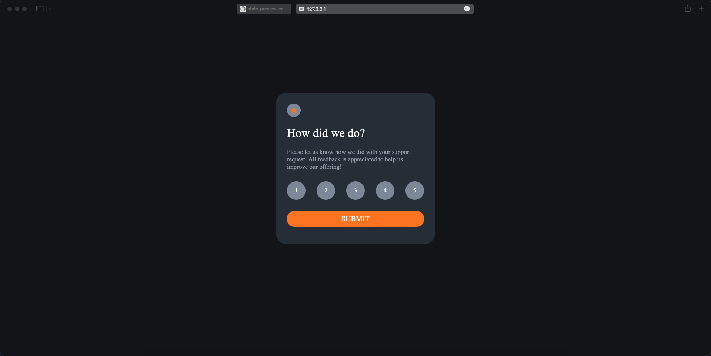
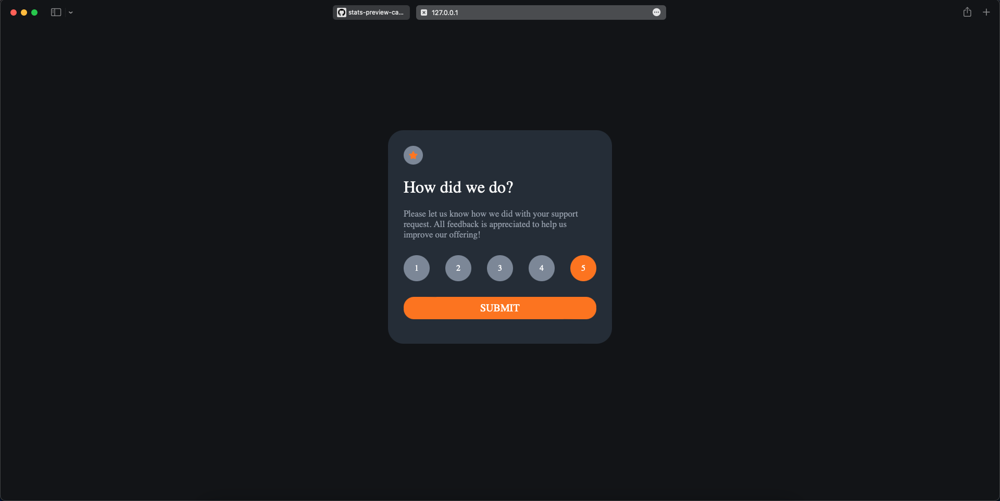
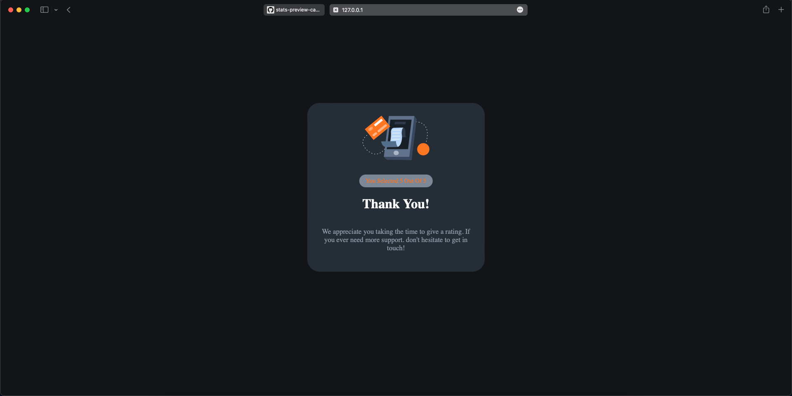
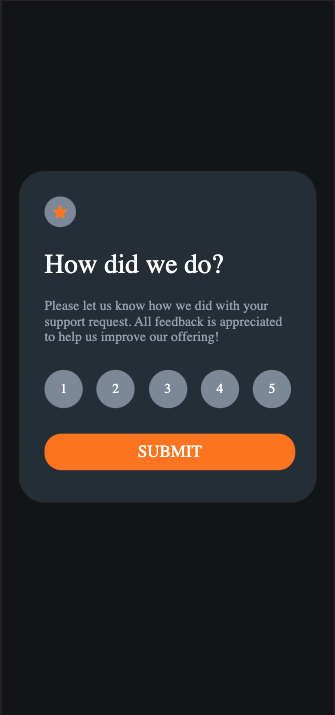
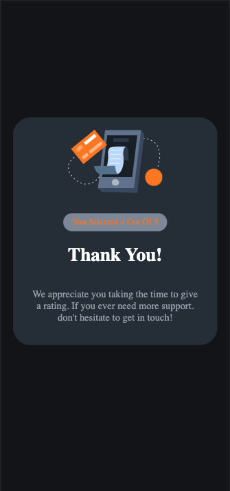

# Frontend Mentor - Interactive rating component

## Table of contents

- [Overview](#overview)
- [Screenshot](#screenshot)
- [Links](#links)
- [Built with](#Built-with)

## Overview
- Interactive rating component created with HTML, CSS and JavaScript.
- User can select rating from 1 to 5 and submit it.
- Next component will show the rating selected by the user.

## Screenshot

## Links

- Live Site URL: [interactive-rating-component-brijen.vercel.app](interactive-rating-component-brijen.vercel.app)

## Built with

- HTML
- CSS
- JavaScript